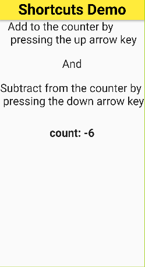

## 1. Research: Flutter Actions and Shortcuts Widgets

- Keywords:
    - flutter shortcuts
    - flutter actions
    - flutter shortcuts widget
    - flutter actions widget
    - flutter shortcuts class
    - flutter actions class
    - flutter shortcuts and actions
    - flutter actions and shortcuts
    - shortcuts and actions in flutter
    - actions and shortcuts in flutter
    - flutter materialapp shortcuts
    - flutter shortcut wrap widget
    - flutter keyboard listener
- Video Title: Actions and Shortcuts in Flutter - Flutter Shortcuts class and Actions class with
  Intent and LogicalKeyboardKey

## 2. Research: Competitors

**Flutter Videos/Articles**

- 45K: https://www.youtube.com/watch?v=6ZcQmdoz9N8
- 49K: https://www.youtube.com/watch?v=XawP1i314WM
- 9.1K: https://www.youtube.com/watch?v=tw6y3Wbds4M
- 480: https://www.youtube.com/watch?v=umuhDwnIq6E
- 3.8K: https://www.youtube.com/watch?v=WMVoNA5cY9A
- https://docs.flutter.dev/development/ui/advanced/actions-and-shortcuts
- https://api.flutter.dev/flutter/widgets/Actions-class.html
- https://api.flutter.dev/flutter/widgets/Shortcuts-class.html
- https://medium.com/@omlondhe/actions-in-flutter-7d7aa708738c
- https://madewithflutter.net/shortcuts-widget-examples/
- https://blog.gskinner.com/archives/2021/11/flutter-keyboard-shortcuts-the-easy-way.html

**Android/Swift/React Videos**

- NA

**Great Features**

- Actions class establishes ActionDispatcher and a map of Intent to Action used when invoking an
  Action. `Intent` can be used to call native code through the platform channels.
- Shortcuts widget is used to define keyboard shortcuts for a user interface(can be used for web
  part in flutter).

**Problems from Videos**

- Question: Does Shortcuts widget works fo web?
  <br/> Answer: Yes, for the example shown use Focus(autofocus:true, child: Widget).

**Problems from Flutter Stackoverflow**

-

## 3. Video Structure

**Main Points / Purpose Of Lesson**

1. In this video, you will learn how to use actions and shortcuts in your flutter app.
2. Main points of this video tutorial:
    - Actions Class in flutter
    - Shortcuts Class in flutter
3. If we use actions and shortcuts together then make user experience better.

**The Structured Main Content**

1. There are three dart files in this project.
2. `my_app.dart` defines some theming properties of this app. `MyApp` class is being called
   in `main.dart`. It calls `HomePage` for its home property.
3. `home_page.dart` contains shortcuts, actions and focus class in it.<br/>
   <br/>

- Outside `HomePage` class, define `IncrementIntent` and `DecrementIntent` which are
  extending `Intent` class and have empty constructor.
  <br/> These are used for `shortcut` and `actions` class.

```dart
class IncrementIntent extends Intent {
  const IncrementIntent();
}

class DecrementIntent extends Intent {
  const DecrementIntent();
}
```

- Initialize `int count = 0;` in the `HomePage` state.
- In `body` of `HomePage`, wrap your widget with `Shortcuts` on which you want to perform actions.
- For `Shortcuts` class, `shortcuts` and `child` are required parameters.
  <br/>**shortcuts** accepts Map of type <ShortcutActivator or LogicalKeySet, Intent>.
  <br/>**child** accepts Map of type <ShortcutActivator or LogicalKeySet, Intent> in key value
  pairs. The Logical keys which are to used for shortcuts.
    - `ShortcutActivator` key type is for single key.
    - `LogicalKeySet` key type is for set of keys.

```dart 
          child: Shortcuts(
            shortcuts: const <ShortcutActivator, Intent>{
              SingleActivator(LogicalKeyboardKey.arrowUp): IncrementIntent(),
              SingleActivator(LogicalKeyboardKey.arrowDown): DecrementIntent(),
            },
            child: Actions(
```

- In `child` of `Shortcuts` widget define `Actions` class. For `Actions`, `actions` and `child` are
  required parameters.
  <br/>**child** accepts widget.
  <br/>**actions** accepts Map of type <Type, Action<Intent>>.
    - Key `Type` is class which is extending Intent. (IncrementIntent and DecrementIntent)
    - Value `Action<Intent>` accepts `CallbackAction<Type>()` and overrides the `onInvoke` method of
      CallbackAction. In `onInvoke` method count value is changed using `setState((){})`.

```dart 
            child: Actions(
              // actions accept Map of type <Type, Action<Intent>>
              actions: {
                IncrementIntent: CallbackAction<IncrementIntent>(
                  onInvoke: (intent) => setState(() {
                    count = count + 1;
                  }),
                ),
                DecrementIntent: CallbackAction<DecrementIntent>(
                  onInvoke: (intent) => setState(() {
                    count = count - 1;
                  }),
                ),
              },
              child: Focus(
```

- In child of `Actions`, define `Focus` class. Set `autofocus` property to `true` to use shortcuts
  key on the child of `Focus` widget.
  <br/>`child` property is required. `Column` is child of `Focus` widget on which we want to perform
  shortcuts class using actions class.

```dart 
              child: Focus(
                autofocus: true,
                child: Column(
                  children: [
                    const Text(
                        'Add to the counter by\n pressing the up arrow key'),
                    const SizedBox(height: 30),
                    const Text('And'),
                    const SizedBox(height: 30),
                    const Text(
                        'Subtract from the counter by\n pressing the down arrow key'),
                    const SizedBox(height: 50),
                    Text(
                      'count: $count',
                      style: const TextStyle(
                        fontWeight: FontWeight.bold,
                      ),
                    ),
                  ],
                ),
              ),
```